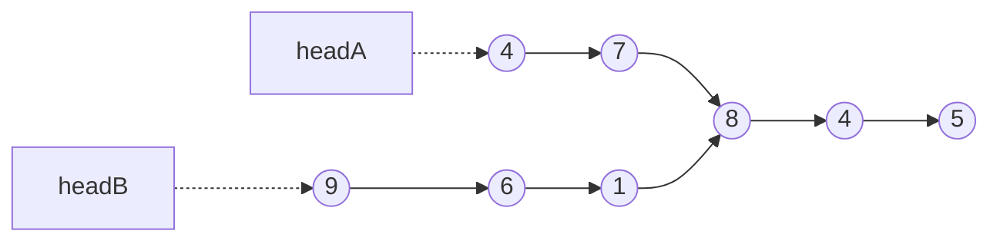

I was leetcode grinding when I stumbled across this extraordinarily elegant solution to the [Intersection of Two Linked Lists](https://leetcode.com/problems/intersection-of-two-linked-lists/) problem.

```python
class Solution:
    def getIntersectionNode(self, headA: ListNode, headB: ListNode) -> Optional[ListNode]:
        x = headA
        y = headB
        
        while x != y:
            x = headB if x is None else x.next
            y = headA if y is None else y.next
        return x
```

I want to illustrate it in [mermaid](https://github.com/mermaid-js/mermaid)
because mermaid rocks and this solution rocks.

Given the following input:
headA = [4,7,8,4,5]
headB = [9,6,1,8,4,5]
Where `8` is the intersection node, here's a mermaid diagram that illustrates
the data structures.



Notice how the two lists intersect at the node with a value of 8.

Also note that list A and list B have different lengths. If they were identical
in length, all we would have to do is iterate through both in tandem until we
found a match.

Let's try to explain the solution before illustrating it. 

```python
x = headA
y = headB
```

We instantiate two pointers and assign them to the head of each list.

```python
while x != y:
```

This conditional is key. When it's met, we've successfully identified the first
intersecting node (`8` in the example above), so we `return x`, though we could
just as easily `return y` given that the two pointers point to the same node.

One really nifty feature of this conditional is it also works when there's no
match! In that scenario, each pointer eventually arrives at `None`, the
condition is satisfied, and the function correctly returns `None`. 


The space complexity O(m+n) where m is the length of headA and n is the length of headB.

There are equally efficient solutions but where this excels is its brevity and [cyclomatic complexity](https://en.wikipedia.org/wiki/Cyclomatic_complexity#:~:text=Cyclomatic%20complexity%20is%20a%20software,was%20developed%20by%20Thomas%20J.).

I'm going to use mermaid to illustrate how it works.  
